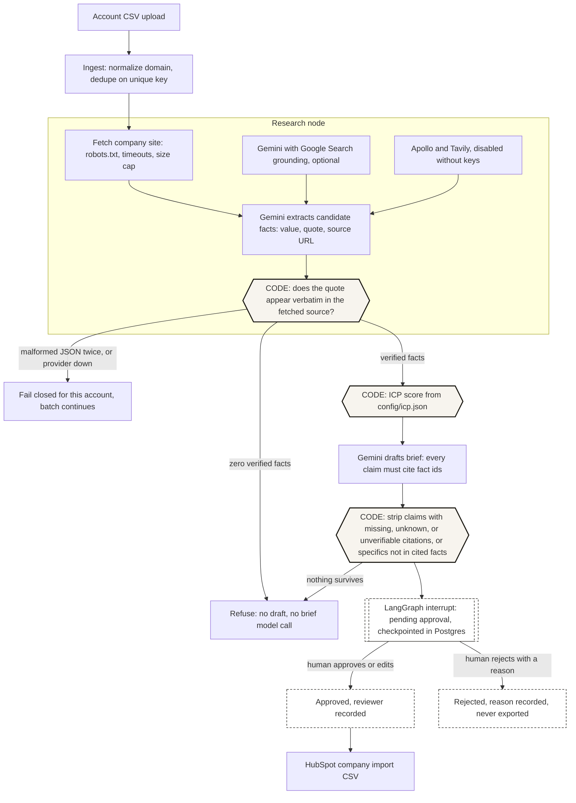

# PALADIN

Account research for outbound sales teams that refuses to invent facts. Upload a list of companies. PALADIN reads each company's website (and, optionally, Google Search results through Gemini), keeps only facts whose supporting quote is actually on the page, scores the account in plain code, drafts a short brief that may only cite those facts, and waits for a human to approve anything before it can be exported to HubSpot.

This branch (`fde-vertical-slice`) is a rebuild. See [What changed from v0](#what-changed-from-v0).

## Who was the customer?

A fictional but specific one, written down before any code: [docs/DISCOVERY_BRIEF.md](docs/DISCOVERY_BRIEF.md). A roughly 25-person B2B SaaS company with 4 SDRs who research target accounts by hand before first touch, working from a CSV account list and importing notes into HubSpot. The brief's working assumption (an assumption, not a measurement): about 20 minutes of research per account and about 40 new accounts per SDR per week.

## What was broken?

- Research was shallow or skipped when the week got busy.
- First lines invented facts about the prospect ("congrats on the Series B" when there was none), which burns accounts.
- Nothing was traceable: no one could say where a claim in the CRM came from.
- Re-imported lists put duplicate companies and stale notes into the CRM.

The constraints that followed: no invented facts, a human approves before anything reaches the CRM, flaky sites and rate limits must not break a batch, and re-running a list must not duplicate anything.

## What did I build?

One vertical slice, from raw CSV to a HubSpot import file:

- **Idempotent ingest.** CSV upload, domains normalized (`https://WWW.Linear.app/about` becomes `linear.app`), dedupe on the normalized domain. Re-uploading a list creates no new accounts.
- **Research.** Fetches up to 8 pages of the company's own site with `httpx` (robots.txt respected per RFC 9309, timeouts, 2 MB cap, no JS). Optionally Gemini with Google Search grounding: we fetch the cited pages ourselves, and a page is used only if it is the company's site or names the company. Apollo and Tavily adapters exist behind `APOLLO_API_KEY` / `TAVILY_API_KEY` and show `provider disabled: no key` when unset.
- **Fact extraction with verification.** Gemini returns candidate facts as structured JSON, each with a source URL and a quote. Code keeps a fact only if the quote appears verbatim in that source's text. A hiring signal is also derived in code from careers pages.
- **Deterministic ICP scoring.** Headcount band, industry keywords, hiring signal, geography. Weights live in [config/icp.json](config/icp.json). The model never scores.
- **Brief drafting with claim validation.** Gemini drafts 2 to 4 claims and a first line, each citing fact ids. Code strips any claim that cites nothing, cites an unknown id, cites a fact whose quote is no longer in the stored source, or contains a number or proper noun that is not in the cited facts. Zero verified facts means no draft and no model call.
- **Durable human approval.** A LangGraph interrupt, checkpointed in Postgres. A reviewer approves, edits, or rejects (a reason is required) in a small server-rendered UI, possibly hours later, from a different process. Human-edited lines are marked `human_written`.
- **HubSpot export.** Approved runs only, as a company import CSV keyed on domain.
- **Tracing.** Every run records nodes, providers used or disabled, every URL fetched with status and latency, facts kept and dropped with reasons, the score breakdown, validation drops, the decision and reviewer, latency per node, tokens, and estimated cost, in Postgres and as JSON log lines.

Stack: Python 3.12 (`uv`), FastAPI with server-rendered Jinja pages, Postgres (`psycopg`), Google Gemini via `google-genai` (Vertex AI with Application Default Credentials, or an API key) as the only model provider, and LangGraph for exactly one thing (below).

**Why LangGraph, and only for this.** The approval step has to pause a run for as long as a human takes and resume it in whatever process handles the click, without redoing research or drafting. `langgraph-checkpoint-postgres` gives that: state is checkpointed per node in the same Postgres database, `interrupt()` pauses, and `Command(resume=...)` continues. `tests/test_graph.py::test_interrupt_resume_survives_process_restart` builds a brand new connection, checkpointer, and graph, and resumes a paused run with zero model calls. Honest caveat: a `status` column plus stored state could do the same job with more hand-written resume code. LangGraph earns its place here, but not by much, and it cost one real bug (the checkpointer cannot share a psycopg connection with trace writes, see [docs/FAILURES.md](docs/FAILURES.md)).

**Why no n8n.** The resume line for v0 said "LangGraph, n8n". n8n was never in the v0 code, and it is not here. One workflow engine is enough, and a second one would split run state across two systems for no gain.

## How does it work?



The model is **not** allowed to decide: whether a fact is supported (code checks the quote against the page), the ICP score (code and config), whether a claim ships (code validation, then a human), whether an account reaches the CRM (only a human approval does), or whether to draft at all when there is no evidence (code refuses before calling it).

Code map: `src/paladin/ingest.py`, `fetch.py`, `research.py`, `icp.py`, `brief.py`, `graph.py` (the LangGraph nodes and interrupt), `runner.py`, `export.py`, `web.py` and `templates/`, `trace.py`, `llm.py` (the only model client), `providers.py`, `cli.py`.

## How did I evaluate it?

On 20 real B2B SaaS companies whose websites were captured on 2026-09-14 and hand-labeled from those captures, plus 3 garbage domains, run through the shipped pipeline with live Gemini (`gemini-3.5-flash` on Vertex AI). Full write-up, including what the numbers do not show: [docs/EVAL_RESULTS.md](docs/EVAL_RESULTS.md).

| Measurement | Result |
|---|---|
| Research fact precision / recall (keyword rubric vs labels) | 84.4% (119 of 141) / 96.8% (60 of 62) |
| Unsupported claims in drafts, human audit, production prompt | 6 of 87 (6.9%) |
| Same facts and model, loose prompt that allows outside knowledge | 26 of 94 (27.7%) |
| Unsupported claims still present after the code check, production prompt | 6 of 86 (7.0%) |
| ICP score identical across 3 reruns | 16 of 19 accounts (max spread 35 points) |
| Garbage domains refused without a brief model call | 3 of 3 |
| Latency per account, p50 / p95 | 32.8 s / 40.1 s (36.6 s / 44.8 s including site fetch) |
| Estimated cost per account (placeholder prices) | 0.022 USD |

What I learned from it:

- **The prompt constraint mattered most.** Restricting drafts to cited facts cut unsupported claims from 27.7% to 6.9% on identical inputs.
- **The code check is narrower than it sounds.** It reliably blocks invented names and numbers, but it did not catch any of the six overstated production claims, and 8 of the 14 claims it stripped were false positives on plurals and abbreviations.
- **The human approval gate is still necessary.** In the end-to-end run the reviewer removed a broker-sourced headquarters claim and rejected a brief built on data-broker funding figures.

Failure cases, each triggered for real with captured logs: [docs/FAILURES.md](docs/FAILURES.md).

## What would I change before production?

- **Semantic claim checking.** The validator proves a claim cites real, on-page quotes and adds no unsupported numbers or names. It does not prove the sentence means what the quote says: a lowercase paraphrase that overstates a quote passes. Next step: an entailment check per claim (a second model pass or an NLI model), measured against a hand-labeled set, plus stricter type-specific extraction rules (for example, an HQ fact must quote "headquarters" or "head office").
- **Source trust tiers and conflict detection.** With grounded search on, the local end-to-end run verified 26 facts from third-party pages (data brokers, review sites, Wikipedia). Quote verification only proves the third party said it, and some of those claims contradict the company's own site (Linear's site says its team is distributed across North America and Europe; a broker page says San Francisco). Those third-party facts also moved Linear's ICP score from 55 (first-party only, in the eval) to 100. Before production: rank sources (company site over aggregators), flag conflicting facts of the same type for the reviewer, carry the fetch date, and let ICP rules require first-party evidence.
- **Research in a worker, not the web process.** Batches run in a thread inside the web server today. On Vercel a function has a hard `maxDuration`, and background work can be frozen after the response is sent. Move research to a queue (a Postgres `SKIP LOCKED` job table or a hosted queue) with one account per job. The approval interrupt is already durable, so the web tier stays stateless. `POST /api/accounts/{id}/run` is the unit that worker would call.
- **Real pricing and spend limits.** Cost is estimated from placeholder token prices in `src/paladin/config.py`. Replace them with current prices for the configured model, and add a per-batch spend cap that stops the batch.
- **Auth.** One seeded operator with a bcrypt hash and a signed cookie is a demo. Use the customer's SSO, per-reviewer accounts, and CSRF protection on forms.
- **Evaluation depth.** 20 companies, one labeling pass by one person, keyword-match scoring. Grow the labeled set, add a second labeler for agreement, and label claim support directly.
- **Freshness.** Put fetch dates on facts in the export, and re-verify quotes before a stale brief is used.
- **Providers.** The Apollo and Tavily adapters were written against their public docs and never run with real keys. Exercise them against sandbox keys before enabling.
- **HubSpot.** Write through the HubSpot API after approval (with the run id as an idempotency key) instead of a CSV, once the customer trusts the approval gate.

## What changed from v0

The first version of PALADIN (still on `main`, one commit) was a TypeScript/Express "Sales Intelligence Platform" with about 24.6k lines of TypeScript. Honest findings from reading it:

- `@langchain/langgraph` was declared in `backend/package.json`, but no source file imported it.
- n8n appeared nowhere in the repository.
- 24 status and report markdown files (for example a completion report grading the project 9.5/10) described the work instead of measuring it. No evaluation existed.

On this branch the TypeScript app and all of those status files were removed. They remain in `main`'s history. The new project is smaller, runs end to end against real websites and a real model, and every number in its docs comes from a script in this repository.

## Run it locally

Requirements: Python 3.12, [`uv`](https://docs.astral.sh/uv/), PostgreSQL 17 binaries, and either a Vertex AI project with Application Default Credentials or a Gemini API key.

```bash
# 1. Throwaway Postgres on port 5545 (no system service needed)
export LC_ALL=en_US.UTF-8 LANG=en_US.UTF-8
PG=/opt/homebrew/opt/postgresql@17/bin
$PG/initdb -D /tmp/paladin-pg -U postgres --auth=trust
$PG/pg_ctl -D /tmp/paladin-pg -o "-p 5545" -l /tmp/paladin-pg.log start
$PG/createdb -h localhost -p 5545 -U postgres paladin

# 2. Configure
cp .env.example .env   # set DATABASE_URL, and the Vertex variables or GEMINI_API_KEY
uv sync

# 3. Database and operator
uv run python -m paladin.cli migrate
PALADIN_OPERATOR_PASSWORD='choose-a-long-password' uv run python -m paladin.cli seed

# 4. Use it
uv run python -m paladin.cli serve --port 8000    # http://127.0.0.1:8000
# or headless:
uv run python -m paladin.cli run --csv examples/accounts_5.csv
uv run python -m paladin.cli decide <run_id> approve --by you@example.com
uv run python -m paladin.cli export --out hubspot.csv

# 5. Tests and eval
$PG/createdb -h localhost -p 5545 -U postgres paladin_test && uv run pytest -q
$PG/createdb -h localhost -p 5545 -U postgres paladin_eval
EVAL_DATABASE_URL=postgresql://postgres@localhost:5545/paladin_eval uv run python -m paladin.cli run-eval
uv run python eval/render_results.py   # rebuilds the number tables in docs/EVAL_RESULTS.md
```

Operations (re-running lists, ICP rules, outages, traces, provider keys, Vercel and Supabase): [RUNBOOK.md](RUNBOOK.md). Failure cases with captured logs: [docs/FAILURES.md](docs/FAILURES.md).

Note on quoted text: eval snapshots and result files contain text captured verbatim from public websites, including their punctuation.
